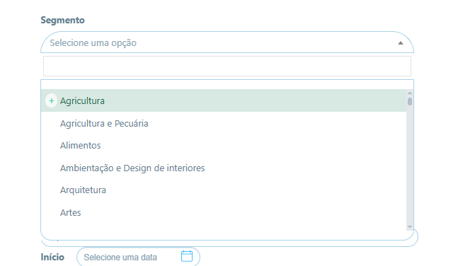
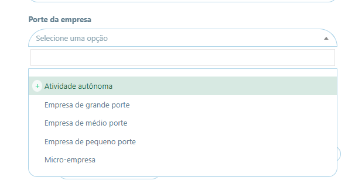
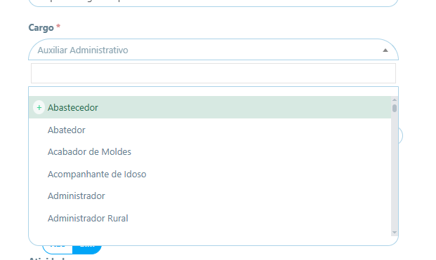
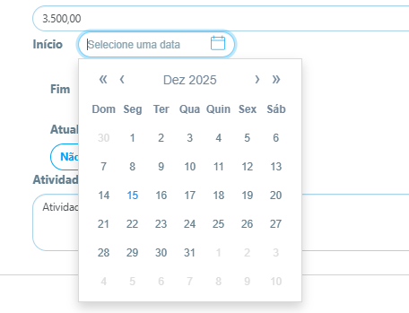
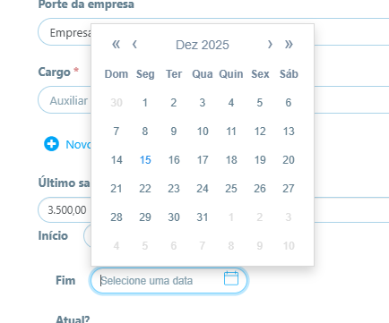
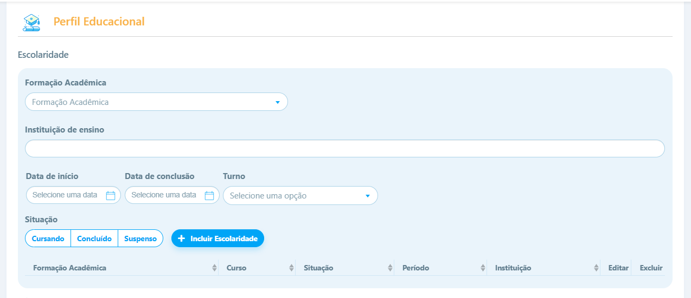
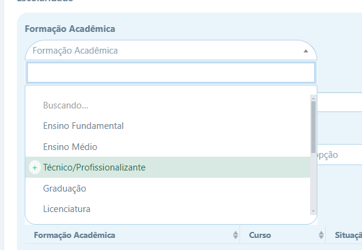
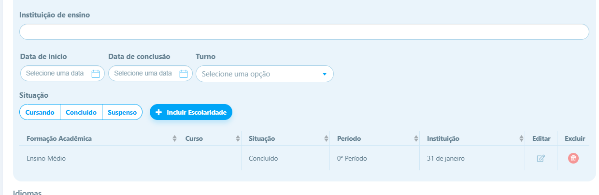

MAPEAMENTO DO SEGMENTO:

<ul class="select2-results__options" role="listbox" id="select2-segment-results" aria-expanded="true"
    aria-hidden="false">
    <li class="select2-results__option" id="select2-segment-result-l3sk-Agricultura" role="option" aria-selected="false"
        data-select2-id="select2-segment-result-l3sk-Agricultura">Agricultura</li>
    <li class="select2-results__option select2-results__option--highlighted"
        id="select2-segment-result-0m8i-Agricultura e Pecuária" role="option" aria-selected="false"
        data-select2-id="select2-segment-result-0m8i-Agricultura e Pecuária">Agricultura e Pecuária</li>
    <li class="select2-results__option" id="select2-segment-result-1id0-Alimentos" role="option" aria-selected="false"
        data-select2-id="select2-segment-result-1id0-Alimentos">Alimentos</li>
    <li class="select2-results__option" id="select2-segment-result-g5we-Ambientação e Design de interiores"
        role="option" aria-selected="false"
        data-select2-id="select2-segment-result-g5we-Ambientação e Design de interiores">Ambientação e Design de
        interiores</li>
    <li class="select2-results__option" id="select2-segment-result-6nau-Arquitetura" role="option" aria-selected="false"
        data-select2-id="select2-segment-result-6nau-Arquitetura">Arquitetura</li>
    <li class="select2-results__option" id="select2-segment-result-lfjc-Artes" role="option" aria-selected="false"
        data-select2-id="select2-segment-result-lfjc-Artes">Artes</li>
    <li class="select2-results__option" id="select2-segment-result-bisz-Assistência Médica" role="option"
        aria-selected="false" data-select2-id="select2-segment-result-bisz-Assistência Médica">Assistência Médica</li>
    <li class="select2-results__option" id="select2-segment-result-wusa-Associações" role="option" aria-selected="false"
        data-select2-id="select2-segment-result-wusa-Associações">Associações</li>
    <li class="select2-results__option" id="select2-segment-result-4uwj-Atividade Odontológica" role="option"
        aria-selected="false" data-select2-id="select2-segment-result-4uwj-Atividade Odontológica">Atividade
        Odontológica</li>
    <li class="select2-results__option" id="select2-segment-result-102s-Auditoria" role="option" aria-selected="false"
        data-select2-id="select2-segment-result-102s-Auditoria">Auditoria</li>
    <li class="select2-results__option" id="select2-segment-result-zsd9-Automotivo" role="option" aria-selected="false"
        data-select2-id="select2-segment-result-zsd9-Automotivo">Automotivo</li>
    <li class="select2-results__option" id="select2-segment-result-og7z-Autopeças" role="option" aria-selected="false"
        data-select2-id="select2-segment-result-og7z-Autopeças">Autopeças</li>
    <li class="select2-results__option" id="select2-segment-result-5p5t-Aviação" role="option" aria-selected="false"
        data-select2-id="select2-segment-result-5p5t-Aviação">Aviação</li>
    <li class="select2-results__option" id="select2-segment-result-99yo-Bancos" role="option" aria-selected="false"
        data-select2-id="select2-segment-result-99yo-Bancos">Bancos</li>
    <li class="select2-results__option" id="select2-segment-result-22m3-Bebidas" role="option" aria-selected="false"
        data-select2-id="select2-segment-result-22m3-Bebidas">Bebidas</li>
    <li class="select2-results__option" id="select2-segment-result-x3cb-Beleza e Estética" role="option"
        aria-selected="false" data-select2-id="select2-segment-result-x3cb-Beleza e Estética">Beleza e Estética</li>
    <li class="select2-results__option" id="select2-segment-result-bud5-Biológicas" role="option" aria-selected="false"
        data-select2-id="select2-segment-result-bud5-Biológicas">Biológicas</li>
    <li class="select2-results__option" id="select2-segment-result-ng8l-Brindes" role="option" aria-selected="false"
        data-select2-id="select2-segment-result-ng8l-Brindes">Brindes</li>
    <li class="select2-results__option" id="select2-segment-result-z4o8-Brinquedos" role="option" aria-selected="false"
        data-select2-id="select2-segment-result-z4o8-Brinquedos">Brinquedos</li>
    <li class="select2-results__option" id="select2-segment-result-kfy8-Calçados e Couro" role="option"
        aria-selected="false" data-select2-id="select2-segment-result-kfy8-Calçados e Couro">Calçados e Couro</li>
    <li class="select2-results__option" id="select2-segment-result-8ogi-Cama, mesa e banho" role="option"
        aria-selected="false" data-select2-id="select2-segment-result-8ogi-Cama, mesa e banho">Cama, mesa e banho</li>
    <li class="select2-results__option" id="select2-segment-result-qa4i-Comércio Atacadista" role="option"
        aria-selected="false" data-select2-id="select2-segment-result-qa4i-Comércio Atacadista">Comércio Atacadista</li>
    <li class="select2-results__option" id="select2-segment-result-0fmo-Comércio Exterior" role="option"
        aria-selected="false" data-select2-id="select2-segment-result-0fmo-Comércio Exterior">Comércio Exterior</li>
    <li class="select2-results__option" id="select2-segment-result-1olm-Comércio Varejista" role="option"
        aria-selected="false" data-select2-id="select2-segment-result-1olm-Comércio Varejista">Comércio Varejista</li>
    <li class="select2-results__option" id="select2-segment-result-j5qu-Comunicação e Marketing" role="option"
        aria-selected="false" data-select2-id="select2-segment-result-j5qu-Comunicação e Marketing">Comunicação e
        Marketing</li>
    <li class="select2-results__option" id="select2-segment-result-67v8-Comunicação Visual e Design" role="option"
        aria-selected="false" data-select2-id="select2-segment-result-67v8-Comunicação Visual e Design">Comunicação
        Visual e Design</li>
    <li class="select2-results__option" id="select2-segment-result-si5p-Concessionária" role="option"
        aria-selected="false" data-select2-id="select2-segment-result-si5p-Concessionária">Concessionária</li>
    <li class="select2-results__option" id="select2-segment-result-yi3j-Construção Civil" role="option"
        aria-selected="false" data-select2-id="select2-segment-result-yi3j-Construção Civil">Construção Civil</li>
    <li class="select2-results__option" id="select2-segment-result-icjy-Consultoria" role="option" aria-selected="false"
        data-select2-id="select2-segment-result-icjy-Consultoria">Consultoria</li>
    <li class="select2-results__option" id="select2-segment-result-9dlj-Contabilidade" role="option"
        aria-selected="false" data-select2-id="select2-segment-result-9dlj-Contabilidade">Contabilidade</li>
    <li class="select2-results__option" id="select2-segment-result-ad6l-Corretoras" role="option" aria-selected="false"
        data-select2-id="select2-segment-result-ad6l-Corretoras">Corretoras</li>
    <li class="select2-results__option" id="select2-segment-result-rk96-Distribuidores" role="option"
        aria-selected="false" data-select2-id="select2-segment-result-rk96-Distribuidores">Distribuidores</li>
    <li class="select2-results__option" id="select2-segment-result-kcm6-Educação" role="option" aria-selected="false"
        data-select2-id="select2-segment-result-kcm6-Educação">Educação</li>
    <li class="select2-results__option" id="select2-segment-result-h5lu-Eletrodomésticos" role="option"
        aria-selected="false" data-select2-id="select2-segment-result-h5lu-Eletrodomésticos">Eletrodomésticos</li>
    <li class="select2-results__option" id="select2-segment-result-nzsx-Embalagens" role="option" aria-selected="false"
        data-select2-id="select2-segment-result-nzsx-Embalagens">Embalagens</li>
    <li class="select2-results__option" id="select2-segment-result-7lbf-Energia" role="option" aria-selected="false"
        data-select2-id="select2-segment-result-7lbf-Energia">Energia</li>
    <li class="select2-results__option" id="select2-segment-result-b6gg-Engenharia" role="option" aria-selected="false"
        data-select2-id="select2-segment-result-b6gg-Engenharia">Engenharia</li>
    <li class="select2-results__option" id="select2-segment-result-bwvq-Ensino e Pesquisa" role="option"
        aria-selected="false" data-select2-id="select2-segment-result-bwvq-Ensino e Pesquisa">Ensino e Pesquisa</li>
    <li class="select2-results__option" id="select2-segment-result-uhbj-Entretenimento – Cultura e Lazer" role="option"
        aria-selected="false" data-select2-id="select2-segment-result-uhbj-Entretenimento – Cultura e Lazer">
        Entretenimento – Cultura e Lazer</li>
    <li class="select2-results__option" id="select2-segment-result-w07d-Esporte" role="option" aria-selected="false"
        data-select2-id="select2-segment-result-w07d-Esporte">Esporte</li>
    <li class="select2-results__option" id="select2-segment-result-lt2x-Farmacêutico" role="option"
        aria-selected="false" data-select2-id="select2-segment-result-lt2x-Farmacêutico">Farmacêutico</li>
    <li class="select2-results__option" id="select2-segment-result-g5ar-Ferramentas" role="option" aria-selected="false"
        data-select2-id="select2-segment-result-g5ar-Ferramentas">Ferramentas</li>
    <li class="select2-results__option" id="select2-segment-result-eof7-Finanças" role="option" aria-selected="false"
        data-select2-id="select2-segment-result-eof7-Finanças">Finanças</li>
    <li class="select2-results__option" id="select2-segment-result-n4rs-Franquias" role="option" aria-selected="false"
        data-select2-id="select2-segment-result-n4rs-Franquias">Franquias</li>
    <li class="select2-results__option" id="select2-segment-result-9mgv-Fumo" role="option" aria-selected="false"
        data-select2-id="select2-segment-result-9mgv-Fumo">Fumo</li>
    <li class="select2-results__option" id="select2-segment-result-hiwb-Governo" role="option" aria-selected="false"
        data-select2-id="select2-segment-result-hiwb-Governo">Governo</li>
    <li class="select2-results__option" id="select2-segment-result-z92s-Gráfica" role="option" aria-selected="false"
        data-select2-id="select2-segment-result-z92s-Gráfica">Gráfica</li>
    <li class="select2-results__option" id="select2-segment-result-vwsg-Higiene e Limpeza" role="option"
        aria-selected="false" data-select2-id="select2-segment-result-vwsg-Higiene e Limpeza">Higiene e Limpeza</li>
    <li class="select2-results__option" id="select2-segment-result-wb2s-Hoteleiro" role="option" aria-selected="false"
        data-select2-id="select2-segment-result-wb2s-Hoteleiro">Hoteleiro</li>
    <li class="select2-results__option" id="select2-segment-result-oqd7-Imobiliário" role="option" aria-selected="false"
        data-select2-id="select2-segment-result-oqd7-Imobiliário">Imobiliário</li>
    <li class="select2-results__option" id="select2-segment-result-uw67-Imprensa e Comunicação" role="option"
        aria-selected="false" data-select2-id="select2-segment-result-uw67-Imprensa e Comunicação">Imprensa e
        Comunicação</li>
    <li class="select2-results__option" id="select2-segment-result-254i-Indústria" role="option" aria-selected="false"
        data-select2-id="select2-segment-result-254i-Indústria">Indústria</li>
    <li class="select2-results__option" id="select2-segment-result-weyv-Internet" role="option" aria-selected="false"
        data-select2-id="select2-segment-result-weyv-Internet">Internet</li>
    <li class="select2-results__option" id="select2-segment-result-ljl7-Jurídico" role="option" aria-selected="false"
        data-select2-id="select2-segment-result-ljl7-Jurídico">Jurídico</li>
    <li class="select2-results__option" id="select2-segment-result-sp8b-Lavanderia" role="option" aria-selected="false"
        data-select2-id="select2-segment-result-sp8b-Lavanderia">Lavanderia</li>
    <li class="select2-results__option" id="select2-segment-result-cccf-Madeira" role="option" aria-selected="false"
        data-select2-id="select2-segment-result-cccf-Madeira">Madeira</li>
    <li class="select2-results__option" id="select2-segment-result-ti42-Máquinas e Equipamentos" role="option"
        aria-selected="false" data-select2-id="select2-segment-result-ti42-Máquinas e Equipamentos">Máquinas e
        Equipamentos</li>
    <li class="select2-results__option" id="select2-segment-result-t5fh-Material de construção" role="option"
        aria-selected="false" data-select2-id="select2-segment-result-t5fh-Material de construção">Material de
        construção</li>
    <li class="select2-results__option" id="select2-segment-result-cb3s-Material de escritório" role="option"
        aria-selected="false" data-select2-id="select2-segment-result-cb3s-Material de escritório">Material de
        escritório</li>
    <li class="select2-results__option" id="select2-segment-result-3jbk-Materiais Elétricos" role="option"
        aria-selected="false" data-select2-id="select2-segment-result-3jbk-Materiais Elétricos">Materiais Elétricos</li>
    <li class="select2-results__option" id="select2-segment-result-wfhc-Material eletrônico (componentes eletrônicos)"
        role="option" aria-selected="false"
        data-select2-id="select2-segment-result-wfhc-Material eletrônico (componentes eletrônicos)">Material eletrônico
        (componentes eletrônicos)</li>
    <li class="select2-results__option" id="select2-segment-result-rbit-Mecânica" role="option" aria-selected="false"
        data-select2-id="select2-segment-result-rbit-Mecânica">Mecânica</li>
    <li class="select2-results__option" id="select2-segment-result-fu2d-Meio Ambiente" role="option"
        aria-selected="false" data-select2-id="select2-segment-result-fu2d-Meio Ambiente">Meio Ambiente</li>
    <li class="select2-results__option" id="select2-segment-result-8dvh-Metalúrgico, Siderúrgico" role="option"
        aria-selected="false" data-select2-id="select2-segment-result-8dvh-Metalúrgico, Siderúrgico">Metalúrgico,
        Siderúrgico</li>
    <li class="select2-results__option" id="select2-segment-result-pm0s-Mineração" role="option" aria-selected="false"
        data-select2-id="select2-segment-result-pm0s-Mineração">Mineração</li>
    <li class="select2-results__option" id="select2-segment-result-0nw0-Móveis e Decoração" role="option"
        aria-selected="false" data-select2-id="select2-segment-result-0nw0-Móveis e Decoração">Móveis e Decoração</li>
    <li class="select2-results__option" id="select2-segment-result-606k-Não Metálicos" role="option"
        aria-selected="false" data-select2-id="select2-segment-result-606k-Não Metálicos">Não Metálicos</li>
    <li class="select2-results__option" id="select2-segment-result-vf7o-Ótica" role="option" aria-selected="false"
        data-select2-id="select2-segment-result-vf7o-Ótica">Ótica</li>
    <li class="select2-results__option" id="select2-segment-result-d214-Papel e Celulose" role="option"
        aria-selected="false" data-select2-id="select2-segment-result-d214-Papel e Celulose">Papel e Celulose</li>
    <li class="select2-results__option" id="select2-segment-result-pc5y-Pecuária" role="option" aria-selected="false"
        data-select2-id="select2-segment-result-pc5y-Pecuária">Pecuária</li>
    <li class="select2-results__option" id="select2-segment-result-rsti-Perfumaria e Cosméticos" role="option"
        aria-selected="false" data-select2-id="select2-segment-result-rsti-Perfumaria e Cosméticos">Perfumaria e
        Cosméticos</li>
    <li class="select2-results__option" id="select2-segment-result-p7ac-Petroquímica" role="option"
        aria-selected="false" data-select2-id="select2-segment-result-p7ac-Petroquímica">Petroquímica</li>
    <li class="select2-results__option" id="select2-segment-result-ixb2-Pintura" role="option" aria-selected="false"
        data-select2-id="select2-segment-result-ixb2-Pintura">Pintura</li>
    <li class="select2-results__option" id="select2-segment-result-lwmy-Plástico e Borracha" role="option"
        aria-selected="false" data-select2-id="select2-segment-result-lwmy-Plástico e Borracha">Plástico e Borracha</li>
    <li class="select2-results__option" id="select2-segment-result-a2de-Promoção de Vendas" role="option"
        aria-selected="false" data-select2-id="select2-segment-result-a2de-Promoção de Vendas">Promoção de Vendas</li>
    <li class="select2-results__option" id="select2-segment-result-50gb-Publicidade" role="option" aria-selected="false"
        data-select2-id="select2-segment-result-50gb-Publicidade">Publicidade</li>
    <li class="select2-results__option" id="select2-segment-result-wgr8-Química" role="option" aria-selected="false"
        data-select2-id="select2-segment-result-wgr8-Química">Química</li>
    <li class="select2-results__option" id="select2-segment-result-vcgk-Recursos Humanos" role="option"
        aria-selected="false" data-select2-id="select2-segment-result-vcgk-Recursos Humanos">Recursos Humanos</li>
    <li class="select2-results__option" id="select2-segment-result-fp5y-Religião" role="option" aria-selected="false"
        data-select2-id="select2-segment-result-fp5y-Religião">Religião</li>
    <li class="select2-results__option" id="select2-segment-result-w44y-Saúde, Hospitalar e Laboratorial" role="option"
        aria-selected="false" data-select2-id="select2-segment-result-w44y-Saúde, Hospitalar e Laboratorial">Saúde,
        Hospitalar e Laboratorial</li>
    <li class="select2-results__option" id="select2-segment-result-3x8m-Securitização de Créditos" role="option"
        aria-selected="false" data-select2-id="select2-segment-result-3x8m-Securitização de Créditos">Securitização de
        Créditos</li>
    <li class="select2-results__option" id="select2-segment-result-et2u-Seguradoras e Previdência Privada" role="option"
        aria-selected="false" data-select2-id="select2-segment-result-et2u-Seguradoras e Previdência Privada">
        Seguradoras e Previdência Privada</li>
    <li class="select2-results__option" id="select2-segment-result-joge-Serviços (outros)" role="option"
        aria-selected="false" data-select2-id="select2-segment-result-joge-Serviços (outros)">Serviços (outros)</li>
    <li class="select2-results__option" id="select2-segment-result-fjqp-Serviços Cartorários" role="option"
        aria-selected="false" data-select2-id="select2-segment-result-fjqp-Serviços Cartorários">Serviços Cartorários
    </li>
    <li class="select2-results__option" id="select2-segment-result-qn7g-Serviços Públicos" role="option"
        aria-selected="false" data-select2-id="select2-segment-result-qn7g-Serviços Públicos">Serviços Públicos</li>
    <li class="select2-results__option" id="select2-segment-result-h2sp-Tecnologia e Informática" role="option"
        aria-selected="false" data-select2-id="select2-segment-result-h2sp-Tecnologia e Informática">Tecnologia e
        Informática</li>
    <li class="select2-results__option" id="select2-segment-result-5959-Telecomunicações" role="option"
        aria-selected="false" data-select2-id="select2-segment-result-5959-Telecomunicações">Telecomunicações</li>
    <li class="select2-results__option" id="select2-segment-result-egpg-Telemarketing / Call Center" role="option"
        aria-selected="false" data-select2-id="select2-segment-result-egpg-Telemarketing / Call Center">Telemarketing /
        Call Center</li>
    <li class="select2-results__option" id="select2-segment-result-pu3t-Terceiro setor / ONG" role="option"
        aria-selected="false" data-select2-id="select2-segment-result-pu3t-Terceiro setor / ONG">Terceiro setor / ONG
    </li>
    <li class="select2-results__option" id="select2-segment-result-jqjc-Têxtil" role="option" aria-selected="false"
        data-select2-id="select2-segment-result-jqjc-Têxtil">Têxtil</li>
    <li class="select2-results__option" id="select2-segment-result-m6dy-Trabalho Doméstico" role="option"
        aria-selected="false" data-select2-id="select2-segment-result-m6dy-Trabalho Doméstico">Trabalho Doméstico</li>
    <li class="select2-results__option" id="select2-segment-result-8sj0-Transporte Aéreo" role="option"
        aria-selected="false" data-select2-id="select2-segment-result-8sj0-Transporte Aéreo">Transporte Aéreo</li>
    <li class="select2-results__option" id="select2-segment-result-j2z7-Transporte e Logística" role="option"
        aria-selected="false" data-select2-id="select2-segment-result-j2z7-Transporte e Logística">Transporte e
        Logística</li>
    <li class="select2-results__option" id="select2-segment-result-qbu7-Turismo" role="option" aria-selected="false"
        data-select2-id="select2-segment-result-qbu7-Turismo">Turismo</li>
    <li class="select2-results__option" id="select2-segment-result-fs4p-Utilidades Domésticas" role="option"
        aria-selected="false" data-select2-id="select2-segment-result-fs4p-Utilidades Domésticas">Utilidades Domésticas
    </li>
    <li class="select2-results__option" id="select2-segment-result-n34z-Vendas" role="option" aria-selected="false"
        data-select2-id="select2-segment-result-n34z-Vendas">Vendas</li>
    <li class="select2-results__option" id="select2-segment-result-e6dh-Vestuário" role="option" aria-selected="false"
        data-select2-id="select2-segment-result-e6dh-Vestuário">Vestuário</li>
    <li class="select2-results__option" id="select2-segment-result-vehh-Veterinária" role="option" aria-selected="false"
        data-select2-id="select2-segment-result-vehh-Veterinária">Veterinária</li>
    <li class="select2-results__option" id="select2-segment-result-rmmg-Indústria Naval" role="option"
        aria-selected="false" data-select2-id="select2-segment-result-rmmg-Indústria Naval">Indústria Naval</li>
</ul>

PASSO 2

<ul class="select2-results__options" role="listbox" id="select2-company_size-yg-results" aria-expanded="true" aria-hidden="false"><li class="select2-results__option select2-results__option--highlighted" id="select2-company_size-yg-result-ppul-Atividade autônoma" role="option" aria-selected="false" data-select2-id="select2-company_size-yg-result-ppul-Atividade autônoma">Atividade autônoma</li><li class="select2-results__option" id="select2-company_size-yg-result-cpx6-Empresa de grande porte" role="option" aria-selected="false" data-select2-id="select2-company_size-yg-result-cpx6-Empresa de grande porte">Empresa de grande porte</li><li class="select2-results__option" id="select2-company_size-yg-result-cw22-Empresa de médio porte" role="option" aria-selected="false" data-select2-id="select2-company_size-yg-result-cw22-Empresa de médio porte">Empresa de médio porte</li><li class="select2-results__option" id="select2-company_size-yg-result-qves-Empresa de pequeno porte" role="option" aria-selected="false" data-select2-id="select2-company_size-yg-result-qves-Empresa de pequeno porte">Empresa de pequeno porte</li><li class="select2-results__option" id="select2-company_size-yg-result-w2sm-Micro-empresa" role="option" aria-selected="false" data-select2-id="select2-company_size-yg-result-w2sm-Micro-empresa">Micro-empresa</li></ul>

caMPO CARGO DO POPUP

<ul class="select2-results__options" role="listbox" id="select2-occupation_id-results" aria-expanded="true" aria-hidden="false"><li class="select2-results__option select2-results__option--highlighted" role="option" aria-selected="false" data-select2-id="357">Abastecedor</li><li class="select2-results__option" role="option" aria-selected="false" data-select2-id="358">Abatedor</li><li class="select2-results__option" role="option" aria-selected="false" data-select2-id="359">Acabador de Moldes</li><li class="select2-results__option" role="option" aria-selected="false" data-select2-id="360">Acompanhante de Idoso</li><li class="select2-results__option" role="option" aria-selected="false" data-select2-id="361">Administrador</li><li class="select2-results__option" role="option" aria-selected="false" data-select2-id="362">Administrador Rural</li><li class="select2-results__option" role="option" aria-selected="false" data-select2-id="363">Administrador de Fazenda</li><li class="select2-results__option" role="option" aria-selected="false" data-select2-id="364">Administrador de Sistemas Operacionais</li><li class="select2-results__option" role="option" aria-selected="false" data-select2-id="365">Administrativo</li><li class="select2-results__option" role="option" aria-selected="false" data-select2-id="366">Administrativo/Financeiro</li><li class="select2-results__option" role="option" aria-selected="false" data-select2-id="367">Advogado</li><li class="select2-results__option" role="option" aria-selected="false" data-select2-id="368">Afiador de Ferramentas</li><li class="select2-results__option" role="option" aria-selected="false" data-select2-id="369">Agenciador</li><li class="select2-results__option" role="option" aria-selected="false" data-select2-id="370">Agente</li><li class="select2-results__option" role="option" aria-selected="false" data-select2-id="371">Agente Administrativo</li><li class="select2-results__option" role="option" aria-selected="false" data-select2-id="372">Agente Ambiental</li><li class="select2-results__option" role="option" aria-selected="false" data-select2-id="373">Agente Comercial</li><li class="select2-results__option" role="option" aria-selected="false" data-select2-id="374">Agente Comunitário de Saúde</li><li class="select2-results__option" role="option" aria-selected="false" data-select2-id="375">Agente Dedetizador</li><li class="select2-results__option" role="option" aria-selected="false" data-select2-id="376">Agente Detetizador</li><li class="select2-results__option" role="option" aria-selected="false" data-select2-id="377">Agente Educador</li><li class="select2-results__option" role="option" aria-selected="false" data-select2-id="378">Agente Funerário</li><li class="select2-results__option" role="option" aria-selected="false" data-select2-id="379">Agente Penitenciário</li><li class="select2-results__option" role="option" aria-selected="false" data-select2-id="380">Agente Sócio Educativo</li><li class="select2-results__option" role="option" aria-selected="false" data-select2-id="381">Agente de Atendimento</li><li class="select2-results__option" role="option" aria-selected="false" data-select2-id="382">Agente de Cobrança</li><li class="select2-results__option" role="option" aria-selected="false" data-select2-id="383">Agente de Eventos</li><li class="select2-results__option" role="option" aria-selected="false" data-select2-id="384">Agente de Marketing</li><li class="select2-results__option" role="option" aria-selected="false" data-select2-id="385">Agente de Negócios</li><li class="select2-results__option" role="option" aria-selected="false" data-select2-id="386">Agente de Portaria</li><li class="select2-results__option" role="option" aria-selected="false" data-select2-id="387">Agente de Registro</li><li class="select2-results__option" role="option" aria-selected="false" data-select2-id="388">Agente de Relações Públicas</li><li class="select2-results__option" role="option" aria-selected="false" data-select2-id="389">Agente de Saneamento</li><li class="select2-results__option" role="option" aria-selected="false" data-select2-id="390">Agente de Saúde</li><li class="select2-results__option" role="option" aria-selected="false" data-select2-id="391">Agente de Segurança</li><li class="select2-results__option" role="option" aria-selected="false" data-select2-id="392">Agente de Telemarketing</li><li class="select2-results__option" role="option" aria-selected="false" data-select2-id="393">Agente de Trânsito</li><li class="select2-results__option" role="option" aria-selected="false" data-select2-id="394">Agente de Turismo</li><li class="select2-results__option" role="option" aria-selected="false" data-select2-id="395">Agente de Vendas</li><li class="select2-results__option" role="option" aria-selected="false" data-select2-id="396">Agente de Viagem</li><li class="select2-results__option" role="option" aria-selected="false" data-select2-id="397">Agrônomo</li><li class="select2-results__option" role="option" aria-selected="false" data-select2-id="398">Ajudante Agrícola</li><li class="select2-results__option" role="option" aria-selected="false" data-select2-id="399">Ajudante Civil</li><li class="select2-results__option" role="option" aria-selected="false" data-select2-id="400">Ajudante Geral</li><li class="select2-results__option" role="option" aria-selected="false" data-select2-id="401">Ajudante Junior</li><li class="select2-results__option" role="option" aria-selected="false" data-select2-id="402">Ajudante Mecânica</li><li class="select2-results__option" role="option" aria-selected="false" data-select2-id="403">Ajudante Mecânico</li><li class="select2-results__option" role="option" aria-selected="false" data-select2-id="404">Ajudante de Acabamento</li><li class="select2-results__option" role="option" aria-selected="false" data-select2-id="405">Ajudante de Armazenamento</li><li class="select2-results__option" role="option" aria-selected="false" data-select2-id="406">Ajudante de Armazém</li><li class="select2-results__option" role="option" aria-selected="false" data-select2-id="407">Ajudante de Caldeira</li><li class="select2-results__option" role="option" aria-selected="false" data-select2-id="408">Ajudante de Carga e Descarga</li><li class="select2-results__option" role="option" aria-selected="false" data-select2-id="409">Ajudante de Cargas</li><li class="select2-results__option" role="option" aria-selected="false" data-select2-id="410">Ajudante de Carpinteiro</li><li class="select2-results__option" role="option" aria-selected="false" data-select2-id="411">Ajudante de Carregamento</li><li class="select2-results__option" role="option" aria-selected="false" data-select2-id="412">Ajudante de Confeiteiro</li><li class="select2-results__option" role="option" aria-selected="false" data-select2-id="413">Ajudante de Cozinha</li><li class="select2-results__option" role="option" aria-selected="false" data-select2-id="414">Ajudante de Depósito</li><li class="select2-results__option" role="option" aria-selected="false" data-select2-id="415">Ajudante de Eletricista</li><li class="select2-results__option" role="option" aria-selected="false" data-select2-id="416">Ajudante de Eletrônica</li><li class="select2-results__option" role="option" aria-selected="false" data-select2-id="417">Ajudante de Embalagem</li><li class="select2-results__option" role="option" aria-selected="false" data-select2-id="418">Ajudante de Entrega</li><li class="select2-results__option" role="option" aria-selected="false" data-select2-id="419">Ajudante de Estamparia</li><li class="select2-results__option" role="option" aria-selected="false" data-select2-id="420">Ajudante de Estoque</li><li class="select2-results__option" role="option" aria-selected="false" data-select2-id="421">Ajudante de Expedição</li><li class="select2-results__option" role="option" aria-selected="false" data-select2-id="422">Ajudante de Forneiro</li><li class="select2-results__option" role="option" aria-selected="false" data-select2-id="423">Ajudante de Fundição</li><li class="select2-results__option" role="option" aria-selected="false" data-select2-id="424">Ajudante de Instalação</li><li class="select2-results__option" role="option" aria-selected="false" data-select2-id="425">Ajudante de Limpeza</li><li class="select2-results__option" role="option" aria-selected="false" data-select2-id="426">Ajudante de Logística</li><li class="select2-results__option" role="option" aria-selected="false" data-select2-id="427">Ajudante de Manutenção</li><li class="select2-results__option" role="option" aria-selected="false" data-select2-id="428">Ajudante de Marcenaria</li><li class="select2-results__option" role="option" aria-selected="false" data-select2-id="429">Ajudante de Marceneiro</li><li class="select2-results__option" role="option" aria-selected="false" data-select2-id="430">Ajudante de Mecânico</li><li class="select2-results__option" role="option" aria-selected="false" data-select2-id="431">Ajudante de Montagem</li><li class="select2-results__option" role="option" aria-selected="false" data-select2-id="432">Ajudante de Motorista</li><li class="select2-results__option" role="option" aria-selected="false" data-select2-id="433">Ajudante de Obras</li><li class="select2-results__option" role="option" aria-selected="false" data-select2-id="434">Ajudante de Padeiro</li><li class="select2-results__option" role="option" aria-selected="false" data-select2-id="435">Ajudante de Pedreiro</li><li class="select2-results__option" role="option" aria-selected="false" data-select2-id="436">Ajudante de Pintor</li><li class="select2-results__option" role="option" aria-selected="false" data-select2-id="437">Ajudante de Pizzaiolo</li><li class="select2-results__option" role="option" aria-selected="false" data-select2-id="438">Ajudante de Produção</li><li class="select2-results__option" role="option" aria-selected="false" data-select2-id="439">Ajudante de Pátio</li><li class="select2-results__option" role="option" aria-selected="false" data-select2-id="440">Ajudante de Serralheiro</li><li class="select2-results__option" role="option" aria-selected="false" data-select2-id="441">Ajudante de Serviços Gerais</li><li class="select2-results__option" role="option" aria-selected="false" data-select2-id="442">Ajudante de Soldador</li><li class="select2-results__option" role="option" aria-selected="false" data-select2-id="443">Ajudante de Tecelagem</li><li class="select2-results__option" role="option" aria-selected="false" data-select2-id="444">Ajudante de Torneiro Mecânico</li><li class="select2-results__option" role="option" aria-selected="false" data-select2-id="445">Ajudante de Vidraceiro</li><li class="select2-results__option" role="option" aria-selected="false" data-select2-id="446">Ajustador Ferramenteiro</li><li class="select2-results__option" role="option" aria-selected="false" data-select2-id="447">Ajustador Mecânico</li><li class="select2-results__option" role="option" aria-selected="false" data-select2-id="448">Alimentador de Linha de Produção</li><li class="select2-results__option" role="option" aria-selected="false" data-select2-id="449">Alinhador de Pneus</li><li class="select2-results__option" role="option" aria-selected="false" data-select2-id="450">Almoxarife</li><li class="select2-results__option" role="option" aria-selected="false" data-select2-id="451">Almoxarife/Estoque</li><li class="select2-results__option" role="option" aria-selected="false" data-select2-id="452">Amostrista</li><li class="select2-results__option" role="option" aria-selected="false" data-select2-id="453">Analista Administrativo</li><li class="select2-results__option" role="option" aria-selected="false" data-select2-id="454">Analista Ambiental</li><li class="select2-results__option" role="option" aria-selected="false" data-select2-id="455">Analista Comercial</li><li class="select2-results__option" role="option" aria-selected="false" data-select2-id="456">Analista Contábil</li></ul>

pASSO 3

<input name="date" type="text" autocomplete="off" placeholder="Selecione uma data" class="form-control"> <!----> <svg xmlns="http://www.w3.org/2000/svg" version="1.1" viewBox="0 0 200 200" class="mx-calendar-icon"><rect x="13" y="29" rx="14" ry="14" width="174" height="158" fill="transparent"></rect> <line x1="46" x2="46" y1="8" y2="50"></line> <line x1="154" x2="154" y1="8" y2="50"></line> <line x1="13" x2="187" y1="70" y2="70"></line> <text x="50%" y="135" font-size="90" stroke-width="1" text-anchor="middle" dominant-baseline="middle"></text></svg>

puppeteer = require('puppeteer'); // v23.0.0 or later

(async () => {
const browser = await puppeteer.launch();
const page = await browser.newPage();
const timeout = 5000;
page.setDefaultTimeout(timeout);

    {
        const targetPage = page;
        await targetPage.setViewport({
            width: 1053,
            height: 773
        })
    }
    {
        const targetPage = page;
        await targetPage.goto('https://selecty.app/curriculum/create-cv/complete/0');
    }
    {
        const targetPage = page;
        await puppeteer.Locator.race([
            targetPage.locator('::-p-aria(Perfil Profissional[role=\\"heading\\"])'),
            targetPage.locator('div:nth-of-type(5) > h2'),
            targetPage.locator('::-p-xpath(//*[@id=\\"formRef\\"]/div/div[2]/div/div/div/div[5]/h2)'),
            targetPage.locator(':scope >>> div:nth-of-type(5) > h2'),
            targetPage.locator('::-p-text(Perfil Profissional)')
        ])
            .setTimeout(timeout)
            .click({
              offset: {
                x: 119.3125,
                y: 17.4375,
              },
            });
    }
    {
        const targetPage = page;
        await puppeteer.Locator.race([
            targetPage.locator('div.col ul'),
            targetPage.locator('::-p-xpath(//*[@id=\\"collapse_professional_experience\\"]/div[1]/div[1]/div[1]/span/span[1]/span/ul)'),
            targetPage.locator(':scope >>> div.col ul')
        ])
            .setTimeout(timeout)
            .click({
              offset: {
                x: 212.5,
                y: 15.625,
              },
            });
    }
    {
        const targetPage = page;
        await puppeteer.Locator.race([
            targetPage.locator('::-p-aria(Salário pretendido)'),
            targetPage.locator('#intended_salary'),
            targetPage.locator('::-p-xpath(//*[@id=\\"intended_salary\\"])'),
            targetPage.locator(':scope >>> #intended_salary'),
            targetPage.locator('::-p-text(0,00)')
        ])
            .setTimeout(timeout)
            .click({
              offset: {
                x: 133.5,
                y: 2.484375,
              },
            });
    }
    {
        const targetPage = page;
        await puppeteer.Locator.race([
            targetPage.locator('::-p-aria(Salário pretendido)'),
            targetPage.locator('#intended_salary'),
            targetPage.locator('::-p-xpath(//*[@id=\\"intended_salary\\"])'),
            targetPage.locator(':scope >>> #intended_salary'),
            targetPage.locator('::-p-text(0,00)')
        ])
            .setTimeout(timeout)
            .fill('250,000');
    }
    {
        const targetPage = page;
        await puppeteer.Locator.race([
            targetPage.locator('div.py-2 > div:nth-of-type(1) > div:nth-of-type(3) ul'),
            targetPage.locator('::-p-xpath(//*[@id=\\"collapse_professional_experience\\"]/div[1]/div[1]/div[3]/div/div/span/span[1]/span/ul)'),
            targetPage.locator(':scope >>> div.py-2 > div:nth-of-type(1) > div:nth-of-type(3) ul')
        ])
            .setTimeout(timeout)
            .click({
              offset: {
                x: 80.5,
                y: 19.640625,
              },
            });
    }
    {
        const targetPage = page;
        await puppeteer.Locator.race([
            targetPage.locator('main div:nth-of-type(4) ul'),
            targetPage.locator('::-p-xpath(//*[@id=\\"collapse_professional_experience\\"]/div[1]/div[1]/div[4]/span/span[1]/span/ul)'),
            targetPage.locator(':scope >>> main div:nth-of-type(4) ul')
        ])
            .setTimeout(timeout)
            .click({
              offset: {
                x: 90.5,
                y: 12.953125,
              },
            });
    }
    {
        const targetPage = page;
        await puppeteer.Locator.race([
            targetPage.locator('::-p-aria( Adicionar Experiência)'),
            targetPage.locator('#collapse_professional_experience > div.row > button'),
            targetPage.locator('::-p-xpath(//*[@id=\\"collapse_professional_experience\\"]/div[2]/button)'),
            targetPage.locator(':scope >>> #collapse_professional_experience > div.row > button'),
            targetPage.locator('::-p-text(Adicionar Experiência)')
        ])
            .setTimeout(timeout)
            .click({
              offset: {
                x: 97.5,
                y: 18.875,
              },
            });
    }
    {
        const targetPage = page;
        await puppeteer.Locator.race([
            targetPage.locator('::-p-aria(Empresa *)'),
            targetPage.locator('#company'),
            targetPage.locator('::-p-xpath(//*[@id=\\"company\\"])'),
            targetPage.locator(':scope >>> #company')
        ])
            .setTimeout(timeout)
            .click({
              offset: {
                x: 145.546875,
                y: 22.40625,
              },
            });
    }
    {
        const targetPage = page;
        await puppeteer.Locator.race([
            targetPage.locator('::-p-aria(Empresa *)'),
            targetPage.locator('#company'),
            targetPage.locator('::-p-xpath(//*[@id=\\"company\\"])'),
            targetPage.locator(':scope >>> #company')
        ])
            .setTimeout(timeout)
            .fill('Empresa Teste LTDAAuxiliar');
    }
    {
        const targetPage = page;
        await puppeteer.Locator.race([
            targetPage.locator('div.col-lg-4 span.selection > span'),
            targetPage.locator('::-p-xpath(//*[@id=\\"professional_experience___BV_modal_body_\\"]/div/div/div/div[2]/span/span[1]/span)'),
            targetPage.locator(':scope >>> div.col-lg-4 span.selection > span')
        ])
            .setTimeout(timeout)
            .click({
              offset: {
                x: 167.546875,
                y: 19.609375,
              },
            });
    }
    {
        const targetPage = page;
        await puppeteer.Locator.race([
            targetPage.locator('::-p-aria(Selecione uma opção) >>>> ::-p-aria([role=\\"generic\\"])'),
            targetPage.locator('#select2-company_size-a8-container > span'),
            targetPage.locator('::-p-xpath(//*[@id=\\"select2-company_size-a8-container\\"]/span)'),
            targetPage.locator(':scope >>> #select2-company_size-a8-container > span')
        ])
            .setTimeout(timeout)
            .click({
              offset: {
                x: 108.546875,
                y: 3.40625,
              },
            });
    }
    {
        const targetPage = page;
        await puppeteer.Locator.race([
            targetPage.locator('::-p-aria(Auxiliar Administrativo) >>>> ::-p-aria([role=\\"generic\\"])'),
            targetPage.locator('#select2-occupation_id-container > span'),
            targetPage.locator('::-p-xpath(//*[@id=\\"select2-occupation_id-container\\"]/span)'),
            targetPage.locator(':scope >>> #select2-occupation_id-container > span'),
            targetPage.locator('::-p-text(Auxiliar Administrativo)')
        ])
            .setTimeout(timeout)
            .click({
              offset: {
                x: 101.546875,
                y: 2.4375,
              },
            });
    }
    {
        const targetPage = page;
        await puppeteer.Locator.race([
            targetPage.locator('#last_salary'),
            targetPage.locator('::-p-xpath(//*[@id=\\"last_salary\\"])'),
            targetPage.locator(':scope >>> #last_salary')
        ])
            .setTimeout(timeout)
            .click({
              offset: {
                x: 65.546875,
                y: 5.203125,
              },
            });
    }
    {
        const targetPage = page;
        await puppeteer.Locator.race([
            targetPage.locator('#last_salary'),
            targetPage.locator('::-p-xpath(//*[@id=\\"last_salary\\"])'),
            targetPage.locator(':scope >>> #last_salary')
        ])
            .setTimeout(timeout)
            .fill('350,000');
    }
    {
        const targetPage = page;
        await puppeteer.Locator.race([
            targetPage.locator('div:nth-of-type(7) input'),
            targetPage.locator('::-p-xpath(//*[@id=\\"start\\"]/div/input)'),
            targetPage.locator(':scope >>> div:nth-of-type(7) input')
        ])
            .setTimeout(timeout)
            .click({
              offset: {
                x: 48.421875,
                y: 5.90625,
              },
            });
    }
    {
        const targetPage = page;
        await puppeteer.Locator.race([
            targetPage.locator('::-p-aria(«)'),
            targetPage.locator('div:nth-of-type(10) a.mx-icon-last-year'),
            targetPage.locator('::-p-xpath(//*[@id=\\"start\\"]/div[1]/a[1])'),
            targetPage.locator(':scope >>> div:nth-of-type(10) a.mx-icon-last-year')
        ])
            .setTimeout(timeout)
            .click({
              count: 2,
              offset: {
                x: 2.421875,
                y: 18.90625,
              },
            });
    }
    {
        const targetPage = page;
        await puppeteer.Locator.race([
            targetPage.locator('::-p-aria(«)'),
            targetPage.locator('div:nth-of-type(10) a.mx-icon-last-year'),
            targetPage.locator('::-p-xpath(//*[@id=\\"start\\"]/div[1]/a[1])'),
            targetPage.locator(':scope >>> div:nth-of-type(10) a.mx-icon-last-year')
        ])
            .setTimeout(timeout)
            .click({
              offset: {
                x: 2.421875,
                y: 18.90625,
              },
            });
    }
    {
        const targetPage = page;
        await puppeteer.Locator.race([
            targetPage.locator('::-p-aria(«)'),
            targetPage.locator('div:nth-of-type(10) a.mx-icon-last-year'),
            targetPage.locator('::-p-xpath(//*[@id=\\"start\\"]/div[1]/a[1])'),
            targetPage.locator(':scope >>> div:nth-of-type(10) a.mx-icon-last-year')
        ])
            .setTimeout(timeout)
            .click({
              offset: {
                x: 2.421875,
                y: 18.90625,
              },
            });
    }
    {
        const targetPage = page;
        await puppeteer.Locator.race([
            targetPage.locator('::-p-aria(«)'),
            targetPage.locator('div:nth-of-type(10) a.mx-icon-last-year'),
            targetPage.locator('::-p-xpath(//*[@id=\\"start\\"]/div[1]/a[1])'),
            targetPage.locator(':scope >>> div:nth-of-type(10) a.mx-icon-last-year')
        ])
            .setTimeout(timeout)
            .click({
              offset: {
                x: 2.421875,
                y: 18.90625,
              },
            });
    }
    {
        const targetPage = page;
        await puppeteer.Locator.race([
            targetPage.locator('::-p-aria(16)'),
            targetPage.locator('div:nth-of-type(10) tr:nth-of-type(3) > td:nth-of-type(4)'),
            targetPage.locator('::-p-xpath(//*[@id=\\"start\\"]/div[2]/table/tbody/tr[3]/td[4])'),
            targetPage.locator(':scope >>> div:nth-of-type(10) tr:nth-of-type(3) > td:nth-of-type(4)')
        ])
            .setTimeout(timeout)
            .click({
              offset: {
                x: 4.421875,
                y: 30.90625,
              },
            });
    }
    {
        const targetPage = page;
        await puppeteer.Locator.race([
            targetPage.locator('#professional_experience___BV_modal_outer_ div:nth-of-type(8) input'),
            targetPage.locator('::-p-xpath(//*[@id=\\"finish\\"]/div/input)'),
            targetPage.locator(':scope >>> #professional_experience___BV_modal_outer_ div:nth-of-type(8) input')
        ])
            .setTimeout(timeout)
            .click({
              offset: {
                x: 90.109375,
                y: 8.265625,
              },
            });
    }
    {
        const targetPage = page;
        await puppeteer.Locator.race([
            targetPage.locator('div:nth-of-type(11) tr:nth-of-type(1) > td:nth-of-type(2)'),
            targetPage.locator('::-p-xpath(//*[@id=\\"finish\\"]/div[2]/table/tbody/tr[1]/td[2])'),
            targetPage.locator(':scope >>> div:nth-of-type(11) tr:nth-of-type(1) > td:nth-of-type(2)')
        ])
            .setTimeout(timeout)
            .click({
              offset: {
                x: 19.109375,
                y: 15.265625,
              },
            });
    }
    {
        const targetPage = page;
        await puppeteer.Locator.race([
            targetPage.locator('#activities'),
            targetPage.locator('::-p-xpath(//*[@id=\\"activities\\"])'),
            targetPage.locator(':scope >>> #activities')
        ])
            .setTimeout(timeout)
            .click({
              offset: {
                x: 67.546875,
                y: 26.328125,
              },
            });
    }
    {
        const targetPage = page;
        await puppeteer.Locator.race([
            targetPage.locator('#activities'),
            targetPage.locator('::-p-xpath(//*[@id=\\"activities\\"])'),
            targetPage.locator(':scope >>> #activities')
        ])
            .setTimeout(timeout)
            .fill('teste');
    }
    {
        const targetPage = page;
        await puppeteer.Locator.race([
            targetPage.locator('::-p-aria(Salvar)'),
            targetPage.locator('#professional_experience___BV_modal_outer_ button.btn-primary'),
            targetPage.locator('::-p-xpath(//*[@id=\\"professional_experience___BV_modal_footer_\\"]/div/button[2])'),
            targetPage.locator(':scope >>> #professional_experience___BV_modal_outer_ button.btn-primary')
        ])
            .setTimeout(timeout)
            .click({
              offset: {
                x: 18.25,
                y: 11.234375,
              },
            });
    }

    await browser.close();

})().catch(err => {
console.error(err);
process.exit(1);
});

<ul class="select2-results__options" role="listbox" id="select2-state-h8-results" aria-expanded="true" aria-hidden="false"><li class="select2-results__option" id="select2-state-h8-result-rm19---" role="option" aria-selected="false" data-select2-id="select2-state-h8-result-rm19---">
-- </li><li class="select2-results__option select2-results__option--highlighted" id="select2-state-h8-result-231d-AC" role="option" aria-selected="false" data-select2-id="select2-state-h8-result-231d-AC">
AC </li><li class="select2-results__option" id="select2-state-h8-result-dmxy-AL" role="option" aria-selected="false" data-select2-id="select2-state-h8-result-dmxy-AL">
AL </li><li class="select2-results__option" id="select2-state-h8-result-f8ut-AP" role="option" aria-selected="false" data-select2-id="select2-state-h8-result-f8ut-AP">
AP </li><li class="select2-results__option" id="select2-state-h8-result-1axm-AM" role="option" aria-selected="false" data-select2-id="select2-state-h8-result-1axm-AM">
AM </li><li class="select2-results__option" id="select2-state-h8-result-47fc-BA" role="option" aria-selected="false" data-select2-id="select2-state-h8-result-47fc-BA">
BA </li><li class="select2-results__option" id="select2-state-h8-result-ghq6-CE" role="option" aria-selected="false" data-select2-id="select2-state-h8-result-ghq6-CE">
CE </li><li class="select2-results__option" id="select2-state-h8-result-3oi8-DF" role="option" aria-selected="false" data-select2-id="select2-state-h8-result-3oi8-DF">
DF </li><li class="select2-results__option" id="select2-state-h8-result-478h-ES" role="option" aria-selected="false" data-select2-id="select2-state-h8-result-478h-ES">
ES </li><li class="select2-results__option" id="select2-state-h8-result-5q59-GO" role="option" aria-selected="false" data-select2-id="select2-state-h8-result-5q59-GO">
GO </li><li class="select2-results__option" id="select2-state-h8-result-w2r4-MA" role="option" aria-selected="false" data-select2-id="select2-state-h8-result-w2r4-MA">
MA </li><li class="select2-results__option" id="select2-state-h8-result-ajxs-MT" role="option" aria-selected="false" data-select2-id="select2-state-h8-result-ajxs-MT">
MT </li><li class="select2-results__option" id="select2-state-h8-result-ogmi-MS" role="option" aria-selected="false" data-select2-id="select2-state-h8-result-ogmi-MS">
MS </li><li class="select2-results__option" id="select2-state-h8-result-nm1z-MG" role="option" aria-selected="false" data-select2-id="select2-state-h8-result-nm1z-MG">
MG </li><li class="select2-results__option" id="select2-state-h8-result-sd3e-PA" role="option" aria-selected="false" data-select2-id="select2-state-h8-result-sd3e-PA">
PA </li><li class="select2-results__option" id="select2-state-h8-result-zt2g-PB" role="option" aria-selected="false" data-select2-id="select2-state-h8-result-zt2g-PB">
PB </li><li class="select2-results__option" id="select2-state-h8-result-yj6s-PE" role="option" aria-selected="false" data-select2-id="select2-state-h8-result-yj6s-PE">
PE </li><li class="select2-results__option" id="select2-state-h8-result-e1ti-PI" role="option" aria-selected="false" data-select2-id="select2-state-h8-result-e1ti-PI">
PI </li><li class="select2-results__option" id="select2-state-h8-result-mmnc-PR" role="option" aria-selected="false" data-select2-id="select2-state-h8-result-mmnc-PR">
PR </li><li class="select2-results__option" id="select2-state-h8-result-veuw-RJ" role="option" aria-selected="false" data-select2-id="select2-state-h8-result-veuw-RJ">
RJ </li><li class="select2-results__option" id="select2-state-h8-result-7jge-RN" role="option" aria-selected="false" data-select2-id="select2-state-h8-result-7jge-RN">
RN </li><li class="select2-results__option" id="select2-state-h8-result-331b-RO" role="option" aria-selected="false" data-select2-id="select2-state-h8-result-331b-RO">
RO </li><li class="select2-results__option" id="select2-state-h8-result-uvi0-RR" role="option" aria-selected="false" data-select2-id="select2-state-h8-result-uvi0-RR">
RR </li><li class="select2-results__option" id="select2-state-h8-result-s5of-RS" role="option" aria-selected="false" data-select2-id="select2-state-h8-result-s5of-RS">
RS </li><li class="select2-results__option" id="select2-state-h8-result-53ck-SC" role="option" aria-selected="false" data-select2-id="select2-state-h8-result-53ck-SC">
SC </li><li class="select2-results__option" id="select2-state-h8-result-rqji-SE" role="option" aria-selected="false" data-select2-id="select2-state-h8-result-rqji-SE">
SE </li><li class="select2-results__option" id="select2-state-h8-result-v26y-SP" role="option" aria-selected="false" data-select2-id="select2-state-h8-result-v26y-SP">
SP </li><li class="select2-results__option" id="select2-state-h8-result-zgjj-TO" role="option" aria-selected="false" data-select2-id="select2-state-h8-result-zgjj-TO">
TO </li></ul>

                            const puppeteer = require('puppeteer'); // v20.7.4 or later

(async () => {
const browser = await puppeteer.launch({headless: 'new'});
const page = await browser.newPage();
const timeout = 5000;
page.setDefaultTimeout(timeout);

    {
        const targetPage = page;
        await targetPage.setViewport({
            width: 1355,
            height: 900
        })
    }
    {
        const targetPage = page;
        const promises = [];
        const startWaitingForEvents = () => {
            promises.push(targetPage.waitForNavigation());
        }
        startWaitingForEvents();
        await targetPage.goto('https://selecty.app/curriculum/create-cv/complete/0');
        await Promise.all(promises);
    }
    {
        const targetPage = page;
        await puppeteer.Locator.race([
            targetPage.locator('::-p-aria(Selecione uma data)'),
            targetPage.locator('div.mb-lg-0 input'),
            targetPage.locator('::-p-xpath(//*[@id=\\"birth_date\\"]/div/input)'),
            targetPage.locator(':scope >>> div.mb-lg-0 input')
        ])
            .setTimeout(timeout)
            .click({
              offset: {
                x: 90,
                y: 0.921875,
              },
            });
    }
    {
        const targetPage = page;
        await puppeteer.Locator.race([
            targetPage.locator('div:nth-of-type(4) tr:nth-of-type(1) > td:nth-of-type(2)'),
            targetPage.locator('::-p-xpath(//*[@id=\\"birth_date\\"]/div[2]/table/tbody/tr[1]/td[2])'),
            targetPage.locator(':scope >>> div:nth-of-type(4) tr:nth-of-type(1) > td:nth-of-type(2)')
        ])
            .setTimeout(timeout)
            .click({
              offset: {
                x: 20,
                y: 11.421875,
              },
            });
    }
    {
        const targetPage = page;
        await puppeteer.Locator.race([
            targetPage.locator('::-p-aria(Selecione uma data)'),
            targetPage.locator('div.mb-lg-0 input'),
            targetPage.locator('::-p-xpath(//*[@id=\\"birth_date\\"]/div/input)'),
            targetPage.locator(':scope >>> div.mb-lg-0 input')
        ])
            .setTimeout(timeout)
            .click({
              offset: {
                x: 108,
                y: 17.921875,
              },
            });
    }
    {
        const targetPage = page;
        await puppeteer.Locator.race([
            targetPage.locator('::-p-aria(«)'),
            targetPage.locator('div:nth-of-type(4) a.mx-icon-last-year'),
            targetPage.locator('::-p-xpath(//*[@id=\\"birth_date\\"]/div[1]/a[1])'),
            targetPage.locator(':scope >>> div:nth-of-type(4) a.mx-icon-last-year')
        ])
            .setTimeout(timeout)
            .click({
              count: 2,
              offset: {
                x: 5,
                y: 17.421875,
              },
            });
    }
    {
        const targetPage = page;
        await puppeteer.Locator.race([
            targetPage.locator('::-p-aria(«)'),
            targetPage.locator('div:nth-of-type(4) a.mx-icon-last-year'),
            targetPage.locator('::-p-xpath(//*[@id=\\"birth_date\\"]/div[1]/a[1])'),
            targetPage.locator(':scope >>> div:nth-of-type(4) a.mx-icon-last-year')
        ])
            .setTimeout(timeout)
            .click({
              offset: {
                x: 5,
                y: 17.421875,
              },
            });
    }
    {
        const targetPage = page;
        await puppeteer.Locator.race([
            targetPage.locator('::-p-aria(«)'),
            targetPage.locator('div:nth-of-type(4) a.mx-icon-last-year'),
            targetPage.locator('::-p-xpath(//*[@id=\\"birth_date\\"]/div[1]/a[1])'),
            targetPage.locator(':scope >>> div:nth-of-type(4) a.mx-icon-last-year')
        ])
            .setTimeout(timeout)
            .click({
              offset: {
                x: 5,
                y: 17.421875,
              },
            });
    }
    {
        const targetPage = page;
        await puppeteer.Locator.race([
            targetPage.locator('::-p-aria(«)'),
            targetPage.locator('div:nth-of-type(4) a.mx-icon-last-year'),
            targetPage.locator('::-p-xpath(//*[@id=\\"birth_date\\"]/div[1]/a[1])'),
            targetPage.locator(':scope >>> div:nth-of-type(4) a.mx-icon-last-year')
        ])
            .setTimeout(timeout)
            .click({
              offset: {
                x: 5,
                y: 17.421875,
              },
            });
    }
    {
        const targetPage = page;
        await puppeteer.Locator.race([
            targetPage.locator('::-p-aria(«)'),
            targetPage.locator('div:nth-of-type(4) a.mx-icon-last-year'),
            targetPage.locator('::-p-xpath(//*[@id=\\"birth_date\\"]/div[1]/a[1])'),
            targetPage.locator(':scope >>> div:nth-of-type(4) a.mx-icon-last-year')
        ])
            .setTimeout(timeout)
            .click({
              offset: {
                x: 5,
                y: 17.421875,
              },
            });
    }
    {
        const targetPage = page;
        await puppeteer.Locator.race([
            targetPage.locator('::-p-aria(«)'),
            targetPage.locator('div:nth-of-type(4) a.mx-icon-last-year'),
            targetPage.locator('::-p-xpath(//*[@id=\\"birth_date\\"]/div[1]/a[1])'),
            targetPage.locator(':scope >>> div:nth-of-type(4) a.mx-icon-last-year')
        ])
            .setTimeout(timeout)
            .click({
              offset: {
                x: 5,
                y: 17.421875,
              },
            });
    }
    {
        const targetPage = page;
        await puppeteer.Locator.race([
            targetPage.locator('::-p-aria(«)'),
            targetPage.locator('div:nth-of-type(4) a.mx-icon-last-year'),
            targetPage.locator('::-p-xpath(//*[@id=\\"birth_date\\"]/div[1]/a[1])'),
            targetPage.locator(':scope >>> div:nth-of-type(4) a.mx-icon-last-year')
        ])
            .setTimeout(timeout)
            .click({
              offset: {
                x: 5,
                y: 17.421875,
              },
            });
    }
    {
        const targetPage = page;
        await puppeteer.Locator.race([
            targetPage.locator('::-p-aria(«)'),
            targetPage.locator('div:nth-of-type(4) a.mx-icon-last-year'),
            targetPage.locator('::-p-xpath(//*[@id=\\"birth_date\\"]/div[1]/a[1])'),
            targetPage.locator(':scope >>> div:nth-of-type(4) a.mx-icon-last-year')
        ])
            .setTimeout(timeout)
            .click({
              offset: {
                x: 5,
                y: 17.421875,
              },
            });
    }
    {
        const targetPage = page;
        await puppeteer.Locator.race([
            targetPage.locator('::-p-aria(«)'),
            targetPage.locator('div:nth-of-type(4) a.mx-icon-last-year'),
            targetPage.locator('::-p-xpath(//*[@id=\\"birth_date\\"]/div[1]/a[1])'),
            targetPage.locator(':scope >>> div:nth-of-type(4) a.mx-icon-last-year')
        ])
            .setTimeout(timeout)
            .click({
              offset: {
                x: 5,
                y: 17.421875,
              },
            });
    }
    {
        const targetPage = page;
        await puppeteer.Locator.race([
            targetPage.locator('::-p-aria(«)'),
            targetPage.locator('div:nth-of-type(4) a.mx-icon-last-year'),
            targetPage.locator('::-p-xpath(//*[@id=\\"birth_date\\"]/div[1]/a[1])'),
            targetPage.locator(':scope >>> div:nth-of-type(4) a.mx-icon-last-year')
        ])
            .setTimeout(timeout)
            .click({
              offset: {
                x: 5,
                y: 17.421875,
              },
            });
    }
    {
        const targetPage = page;
        await puppeteer.Locator.race([
            targetPage.locator('::-p-aria(Selecione uma data)'),
            targetPage.locator('div.mb-lg-0 input'),
            targetPage.locator('::-p-xpath(//*[@id=\\"birth_date\\"]/div/input)'),
            targetPage.locator(':scope >>> div.mb-lg-0 input')
        ])
            .setTimeout(timeout)
            .click({
              offset: {
                x: 12,
                y: 11.921875,
              },
            });
    }
    {
        const targetPage = page;
        await puppeteer.Locator.race([
            targetPage.locator('div.card div:nth-of-type(1) > div.card'),
            targetPage.locator('::-p-xpath(//*[@id=\\"collapse_personal_data\\"]/div[1]/div[2])'),
            targetPage.locator(':scope >>> div.card div:nth-of-type(1) > div.card')
        ])
            .setTimeout(timeout)
            .click({
              offset: {
                x: 7.5,
                y: 214.421875,
              },
            });
    }
    {
        const targetPage = page;
        await puppeteer.Locator.race([
            targetPage.locator('::-p-aria(Selecione uma data)'),
            targetPage.locator('div.mb-lg-0 input'),
            targetPage.locator('::-p-xpath(//*[@id=\\"birth_date\\"]/div/input)'),
            targetPage.locator(':scope >>> div.mb-lg-0 input')
        ])
            .setTimeout(timeout)
            .fill('12/10/1999');
    }
    {
        const targetPage = page;
        await puppeteer.Locator.race([
            targetPage.locator('div.card div:nth-of-type(1) > div.card'),
            targetPage.locator('::-p-xpath(//*[@id=\\"collapse_personal_data\\"]/div[1]/div[2])'),
            targetPage.locator(':scope >>> div.card div:nth-of-type(1) > div.card')
        ])
            .setTimeout(timeout)
            .click({
              offset: {
                x: 1.5,
                y: 189.421875,
              },
            });
    }
    {
        const targetPage = page;
        await puppeteer.Locator.race([
            targetPage.locator('::-p-aria(Selecione uma data)'),
            targetPage.locator('div.mb-lg-0 input'),
            targetPage.locator('::-p-xpath(//*[@id=\\"birth_date\\"]/div/input)'),
            targetPage.locator(':scope >>> div.mb-lg-0 input')
        ])
            .setTimeout(timeout)
            .click({
              offset: {
                x: 107,
                y: 12.921875,
              },
            });
    }
    {
        const targetPage = page;
        await puppeteer.Locator.race([
            targetPage.locator('#collapse_personal_data > div:nth-of-type(2) > div'),
            targetPage.locator('::-p-xpath(//*[@id=\\"collapse_personal_data\\"]/div[2]/div)'),
            targetPage.locator(':scope >>> #collapse_personal_data > div:nth-of-type(2) > div')
        ])
            .setTimeout(timeout)
            .click({
              offset: {
                x: 389.5,
                y: 16.125,
              },
            });
    }

    await browser.close();

})().catch(err => {
console.error(err);
process.exit(1);
});

Perfil eduucacional

formação acadêmica

<ul class="select2-results__options" role="listbox" id="select2-education_level_id-results" aria-expanded="true" aria-hidden="false"><li class="select2-results__option select2-results__option--highlighted" role="option" aria-selected="false" data-select2-id="3588">Ensino Fundamental</li><li class="select2-results__option" role="option" aria-selected="false" data-select2-id="3589">Ensino Médio</li><li class="select2-results__option" role="option" aria-selected="false" data-select2-id="3590">Técnico/Profissionalizante</li><li class="select2-results__option" role="option" aria-selected="false" data-select2-id="3591">Graduação</li><li class="select2-results__option" role="option" aria-selected="false" data-select2-id="3592">Licenciatura</li><li class="select2-results__option" role="option" aria-selected="false" data-select2-id="3593">Pós-Graduação</li><li class="select2-results__option" role="option" aria-selected="false" data-select2-id="3594">Pós-Graduação - MBA</li><li class="select2-results__option" role="option" aria-selected="false" data-select2-id="3595">Mestrado</li><li class="select2-results__option" role="option" aria-selected="false" data-select2-id="3596">Doutorado</li><li class="select2-results__option" role="option" aria-selected="false" data-select2-id="3597">Pós-Doutorado</li><li class="select2-results__option" role="option" aria-selected="false" data-select2-id="3598">Não alfabetizado</li></ul>

turno

<ul class="select2-results__options" role="listbox" id="select2-form_education_time-results" aria-expanded="true" aria-hidden="false"><li class="select2-results__option select2-results__option--highlighted" id="select2-form_education_time-result-f6dv-m" role="option" aria-selected="false" data-select2-id="select2-form_education_time-result-f6dv-m">Manhã</li><li class="select2-results__option" id="select2-form_education_time-result-nee0-a" role="option" aria-selected="false" data-select2-id="select2-form_education_time-result-nee0-a">Tarde</li><li class="select2-results__option" id="select2-form_education_time-result-qgdy-n" role="option" aria-selected="false" data-select2-id="select2-form_education_time-result-qgdy-n">Noite</li></ul>

situação

<label class="btn btn-secondary"><input type="radio" name="radio_group_field_studying" autocomplete="off" class="" value="s" data-parsley-multiple="radio_group_field_studying" id="__BVID__109">Cursando</label> <label class="btn btn-secondary"><input type="radio" name="radio_group_field_studying" autocomplete="off" class="" value="c" data-parsley-multiple="radio_group_field_studying" id="__BVID__110">Concluído</label> <label class="btn btn-secondary"><input type="radio" name="radio_group_field_studying" autocomplete="off" class="" value="p" data-parsley-multiple="radio_group_field_studying" id="__BVID__111">Suspenso</label>

script executando e clicando em incluir escolaridade:

const puppeteer = require('puppeteer'); // v20.7.4 or later

(async () => {
const browser = await puppeteer.launch({headless: 'new'});
const page = await browser.newPage();
const timeout = 5000;
page.setDefaultTimeout(timeout);

    {
        const targetPage = page;
        await targetPage.setViewport({
            width: 1355,
            height: 900
        })
    }
    {
        const targetPage = page;
        const promises = [];
        const startWaitingForEvents = () => {
            promises.push(targetPage.waitForNavigation());
        }
        startWaitingForEvents();
        await targetPage.goto('https://selecty.app/curriculum/create-cv/complete/0');
        await Promise.all(promises);
    }
    {
        const targetPage = page;
        await puppeteer.Locator.race([
            targetPage.locator('::-p-aria(Ensino Médio[role=\\"combobox\\"])'),
            targetPage.locator('#collapse_formation > div:nth-of-type(1) div.col-lg-5 span.selection > span'),
            targetPage.locator('::-p-xpath(//*[@id=\\"collapse_formation\\"]/div[1]/div/div/div[1]/div[1]/span/span[1]/span)'),
            targetPage.locator(':scope >>> #collapse_formation > div:nth-of-type(1) div.col-lg-5 span.selection > span')
        ])
            .setTimeout(timeout)
            .click({
              offset: {
                x: 167,
                y: 21.359375,
              },
            });
    }
    {
        const targetPage = page;
        await puppeteer.Locator.race([
            targetPage.locator('::-p-aria(Instituição de ensino)'),
            targetPage.locator('#institute'),
            targetPage.locator('::-p-xpath(//*[@id=\\"institute\\"])'),
            targetPage.locator(':scope >>> #institute')
        ])
            .setTimeout(timeout)
            .click({
              offset: {
                x: 125,
                y: 6.015625,
              },
            });
    }
    {
        const targetPage = page;
        await puppeteer.Locator.race([
            targetPage.locator('::-p-aria(Instituição de ensino)'),
            targetPage.locator('#institute'),
            targetPage.locator('::-p-xpath(//*[@id=\\"institute\\"])'),
            targetPage.locator(':scope >>> #institute')
        ])
            .setTimeout(timeout)
            .fill('31 de janeiro');
    }
    {
        const targetPage = page;
        await puppeteer.Locator.race([
            targetPage.locator('#collapse_formation > div:nth-of-type(1) div.my-2 > div:nth-of-type(3) input'),
            targetPage.locator('::-p-xpath(//*[@id=\\"start\\"]/div/input)'),
            targetPage.locator(':scope >>> #collapse_formation > div:nth-of-type(1) div.my-2 > div:nth-of-type(3) input')
        ])
            .setTimeout(timeout)
            .click({
              offset: {
                x: 79.5,
                y: 14.015625,
              },
            });
    }
    {
        const targetPage = page;
        await puppeteer.Locator.race([
            targetPage.locator('#collapse_formation > div:nth-of-type(1) div.my-2 > div:nth-of-type(3) input'),
            targetPage.locator('::-p-xpath(//*[@id=\\"start\\"]/div/input)'),
            targetPage.locator(':scope >>> #collapse_formation > div:nth-of-type(1) div.my-2 > div:nth-of-type(3) input')
        ])
            .setTimeout(timeout)
            .fill('10/06/2016');
    }
    {
        const targetPage = page;
        await puppeteer.Locator.race([
            targetPage.locator('#collapse_formation > div:nth-of-type(1) div:nth-of-type(4) input'),
            targetPage.locator('::-p-xpath(//*[@id=\\"conclude\\"]/div/input)'),
            targetPage.locator(':scope >>> #collapse_formation > div:nth-of-type(1) div:nth-of-type(4) input')
        ])
            .setTimeout(timeout)
            .click({
              offset: {
                x: 95,
                y: 18.015625,
              },
            });
    }
    {
        const targetPage = page;
        await puppeteer.Locator.race([
            targetPage.locator('#collapse_formation > div:nth-of-type(1) div:nth-of-type(4) input'),
            targetPage.locator('::-p-xpath(//*[@id=\\"conclude\\"]/div/input)'),
            targetPage.locator(':scope >>> #collapse_formation > div:nth-of-type(1) div:nth-of-type(4) input')
        ])
            .setTimeout(timeout)
            .fill('10/06/2020');
    }
    {
        const targetPage = page;
        await puppeteer.Locator.race([
            targetPage.locator('#collapse_formation > div:nth-of-type(1) div.col-lg-3'),
            targetPage.locator('::-p-xpath(//*[@id=\\"collapse_formation\\"]/div[1]/div/div/div[1]/div[5])'),
            targetPage.locator(':scope >>> #collapse_formation > div:nth-of-type(1) div.col-lg-3'),
            targetPage.locator('::-p-text(Turno Selecione)')
        ])
            .setTimeout(timeout)
            .click({
              offset: {
                x: 108,
                y: 23.015625,
              },
            });
    }
    {
        const targetPage = page;
        await puppeteer.Locator.race([
            targetPage.locator('#select2-form_education_time-container > span'),
            targetPage.locator('::-p-xpath(//*[@id=\\"select2-form_education_time-container\\"]/span)'),
            targetPage.locator(':scope >>> #select2-form_education_time-container > span')
        ])
            .setTimeout(timeout)
            .click({
              offset: {
                x: 91,
                y: 9.59375,
              },
            });
    }
    {
        const targetPage = page;
        await puppeteer.Locator.race([
            targetPage.locator('#collapse_formation > div:nth-of-type(1) label:nth-of-type(2)'),
            targetPage.locator('::-p-xpath(//*[@id=\\"btnradiosstudying\\"]/label[2])'),
            targetPage.locator(':scope >>> #collapse_formation > div:nth-of-type(1) label:nth-of-type(2)')
        ])
            .setTimeout(timeout)
            .click({
              offset: {
                x: 60.46875,
                y: 18.171875,
              },
            });
    }
    {
        const targetPage = page;
        await puppeteer.Locator.race([
            targetPage.locator('::-p-aria( Incluir Escolaridade)'),
            targetPage.locator('#schoolingIncludeBtn'),
            targetPage.locator('::-p-xpath(//*[@id=\\"schoolingIncludeBtn\\"])'),
            targetPage.locator(':scope >>> #schoolingIncludeBtn'),
            targetPage.locator('::-p-text(Incluir Escolaridade)')
        ])
            .setTimeout(timeout)
            .click({
              offset: {
                x: 116.96875,
                y: 15.171875,
              },
            });
    }
    {
        const targetPage = page;
        await puppeteer.Locator.race([
            targetPage.locator('::-p-aria(Ensino Médio)'),
            targetPage.locator('#app td:nth-of-type(1)'),
            targetPage.locator('::-p-xpath(//*[@id=\\"__BVID__112\\"]/tbody/tr/td[1])'),
            targetPage.locator(':scope >>> #app td:nth-of-type(1)')
        ])
            .setTimeout(timeout)
            .click({
              offset: {
                x: 87,
                y: 29.421875,
              },
            });
    }

    await browser.close();

})().catch(err => {
console.error(err);
process.exit(1);
});

visualização depois de criado

